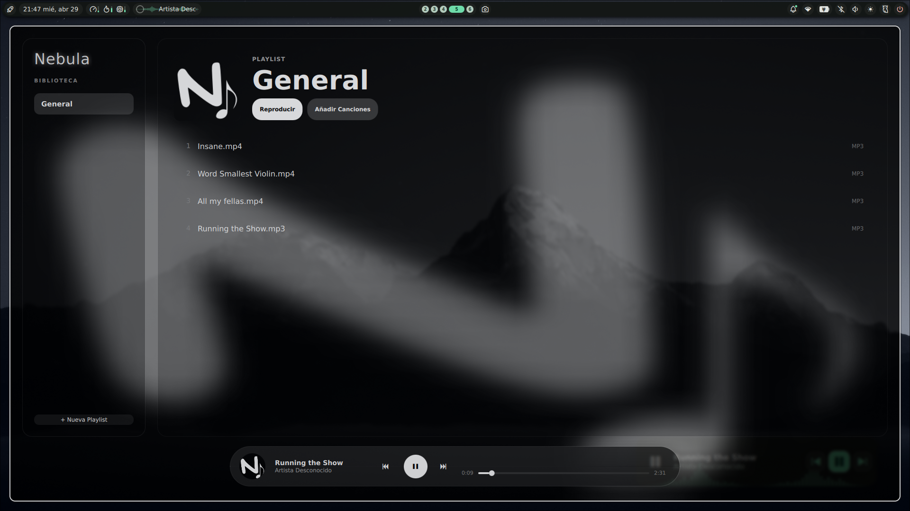
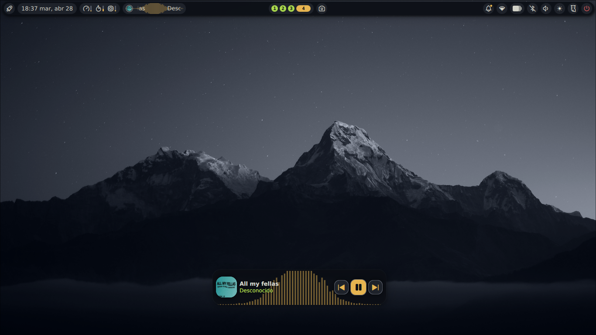
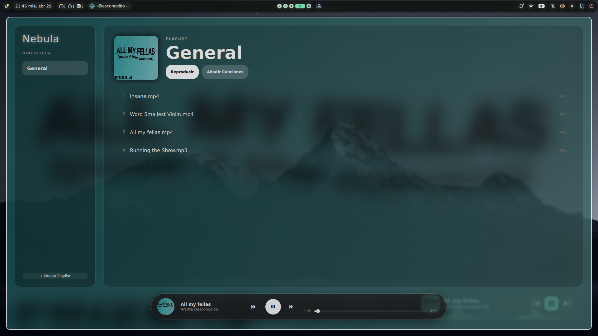

¡Novedades de Nebula-Music V2.1!
Restructuracion completa de archivos y mejor organizacion para facilitar y desarollo y progresar mas rapido 

Mpris activo y Extraccion de caractulas con FFEMPG

Mejora en el rendimiento con optimizacion de logica C++ y ligeros cambios en la interaz (QML)

Nuevas versiones para : debian (.deb), fedora (.rpm), Universal (flatpak) 

¿Como me ayudas?

Comparte y...... ¡Prueba el proyecto!

Dime que te parece y en que puedo mejorar en Nebula-Music asi podre ir mejorando y puliendo aun mas, Tambien notificame si hay errores en la App o algunas de sus funciones, incluso errores en paquetes

Futuro (Version V3) : Nuevo visualizador de barras saltarinas, mejora en la extraccion de caractulas y soporte para nuevos formatos, Nuevas version portable: AppImage

