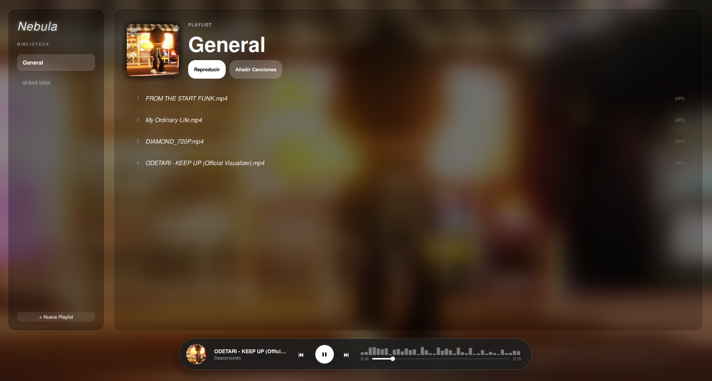

# 🌌 Nebula Music 

Reproductor de música minimalista y ultra ligero hecho en C++ y Qt6.

 ✨ Características
* Muy ligero y buen rendimiento
* 🎨  Diseño moderno y minimalista
* 📂  Version V1 con soporte para mp4 y mp3

Instalacion mediante compilacion o el .flatpak 
instalacion: Clonar: git clone https://github.com/frankkiwi0/Nebula-Music

Instalar dependencias: --needed base-devel cmake qt6-base qt6-declarative qt6-multimedia taglib ffmpeg

Compilar: mkdir build && cd build
cmake ..
make
./appNebulaTahoe

para el .flatpak descomprime el .zip y te dejara un archivo llamado : NebulaMusic.flatpak   
ahora instalalo (asegurate de estar dentro de la carpeta donde descomprimiste el .zip) 
flatpak install NebulaMusic.flatpak

